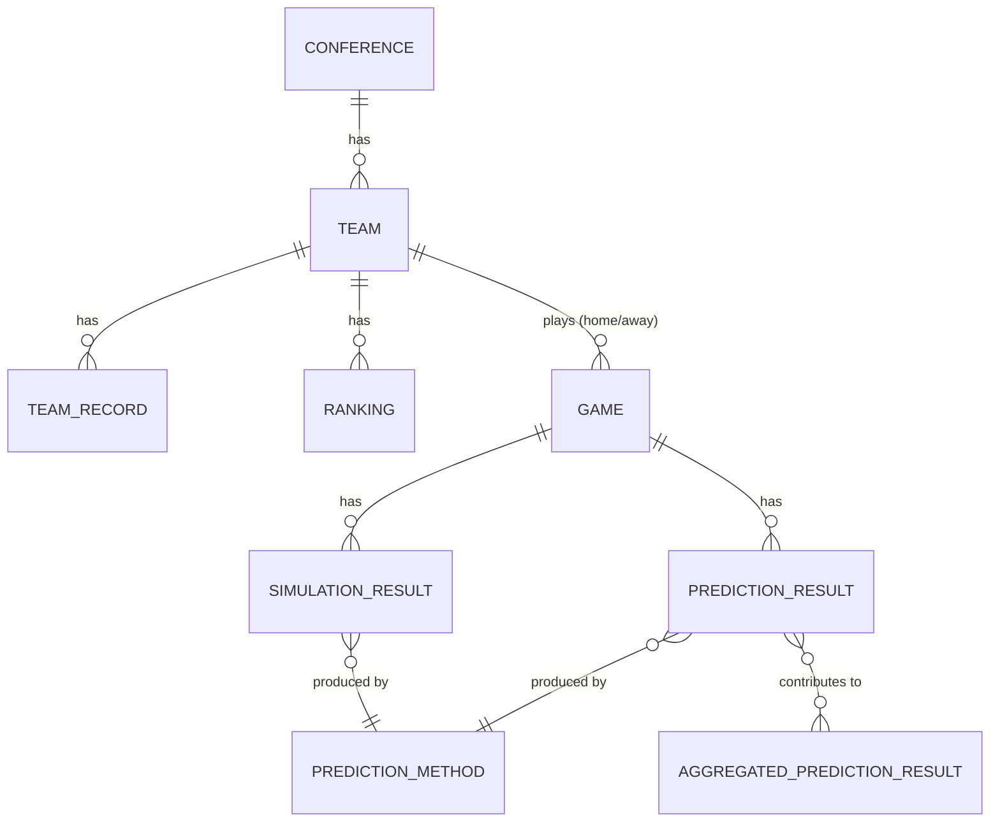

# Shared Domain Model

This document defines the shared domain models and data schema used across the frontend, the Java backend, the Python prediction service, and the persistence layer. It establishes the canonical structure and terminology for core application data so each component can exchange and interpret information consistently, ahead of API contracts, database schemas, and prediction-service interfaces being finalized.

## Conventions

These conventions apply to every model below unless a model states otherwise.

- **Wire format field names are `camelCase`.** This is the shape components exchange over HTTP/JSON. Each component maps camelCase JSON fields to its own language convention at the boundary: Java DTOs use `camelCase` fields directly, JavaScript/TypeScript use the JSON as-is, and the Python prediction service converts to `snake_case` on deserialization (and back to camelCase on serialization) rather than exposing snake_case on the wire.
- **Identifiers (`id`) are UUID v4 strings**, generated by whichever component first creates the canonical record (typically the backend during data ingestion). Entities sourced from the client-provided data feed (`Team`, `Game`) also carry an `externalId` — the identifier used in that source feed — so ingested records stay traceable back to their source without forcing every component to agree on the feed's own ID format. See [ADR: Shared domain model conventions](../decisions/2026-09-22-shared-domain-model-conventions.md) for the reasoning.
- **Timestamps** are ISO 8601 strings in UTC (e.g. `2026-09-22T18:00:00Z`), named with an `At` suffix (`scheduledAt`, `generatedAt`).
- **Enums** are represented as `UPPER_SNAKE_CASE` strings (e.g. `IN_PROGRESS`, `MONTE_CARLO`), so the same literal values are usable unmodified in Java enums, Python enums, and JavaScript string unions.
- **Relationships** between entities are expressed as `<entity>Id` foreign-key fields (e.g. `homeTeamId`) rather than embedding full objects, except for small value objects with no independent identity (e.g. `venue` on `Game`).

## Entity Relationships



---

## Team

A college football program that plays games and belongs to a conference.

| Field | Type | Required | Description |
|---|---|---|---|
| `id` | string (UUID) | yes | Canonical identifier. |
| `externalId` | string | no | Identifier from the source data feed. |
| `name` | string | yes | Full team name, e.g. `"Oklahoma Sooners"`. |
| `shortName` | string | no | Abbreviated/common name, e.g. `"Oklahoma"`. |
| `conferenceId` | string (UUID) | yes | The `Conference` this team belongs to. |
| `division` | string | no | Conference division/group, if applicable. |
| `logoUrl` | string (URI) | no | Team logo image. |

```json
{
  "id": "b3b6c2a0-6e2a-4c1e-9d3a-1f2e3d4c5b6a",
  "externalId": "OU",
  "name": "Oklahoma Sooners",
  "shortName": "Oklahoma",
  "conferenceId": "4e2b8f1a-3c9d-4a7e-8b2f-6d1c0a9e8f7b",
  "logoUrl": "https://example.com/logos/oklahoma.png"
}
```

## Conference

A grouping of teams that compete together, e.g. the SEC or Big 12.

| Field | Type | Required | Description |
|---|---|---|---|
| `id` | string (UUID) | yes | Canonical identifier. |
| `name` | string | yes | Full conference name, e.g. `"Southeastern Conference"`. |
| `shortName` | string | no | Common abbreviation, e.g. `"SEC"`. |

```json
{
  "id": "4e2b8f1a-3c9d-4a7e-8b2f-6d1c0a9e8f7b",
  "name": "Southeastern Conference",
  "shortName": "SEC"
}
```

## Game

A single matchup between two teams, scheduled or played.

| Field | Type | Required | Description |
|---|---|---|---|
| `id` | string (UUID) | yes | Canonical identifier. |
| `externalId` | string | no | Identifier from the source data feed. |
| `season` | integer | yes | Season year, e.g. `2025`. |
| `week` | integer | no | Week number within the season, if applicable. |
| `homeTeamId` | string (UUID) | yes | The home `Team`. |
| `awayTeamId` | string (UUID) | yes | The away `Team`. |
| `venue` | Venue object | no | See [Location / Venue](#location--venue). |
| `scheduledAt` | timestamp | yes | Scheduled kickoff time. |
| `status` | [GameStatus](#game-status) | yes | Current lifecycle state of the game. |
| `homeScore` | integer | no | Present once the game has started; final once `status` is `FINAL`. |
| `awayScore` | integer | no | Same as `homeScore`. |
| `winnerTeamId` | string (UUID) | no | Derived once `status` is `FINAL`; see [Historical Game Result](#historical-game-result). |

```json
{
  "id": "9c1e2d3b-4a5f-4e6d-8b7c-1a2b3c4d5e6f",
  "externalId": "2025-W1-OU-vs-TEM",
  "season": 2025,
  "week": 1,
  "homeTeamId": "b3b6c2a0-6e2a-4c1e-9d3a-1f2e3d4c5b6a",
  "awayTeamId": "1a2b3c4d-5e6f-4a7b-8c9d-0e1f2a3b4c5d",
  "venue": {
    "name": "Gaylord Family Oklahoma Memorial Stadium",
    "city": "Norman",
    "state": "OK",
    "isNeutralSite": false
  },
  "scheduledAt": "2025-08-30T19:00:00Z",
  "status": "SCHEDULED",
  "homeScore": null,
  "awayScore": null,
  "winnerTeamId": null
}
```

## Game Status

Enum used on `Game.status`.

| Value | Meaning |
|---|---|
| `SCHEDULED` | Game has not started. |
| `IN_PROGRESS` | Game is currently being played. |
| `FINAL` | Game has concluded; scores and `winnerTeamId` are set. |
| `POSTPONED` | Game was delayed to a later, not-yet-determined date. |
| `CANCELLED` | Game will not be played. |

## Team Record

A team's aggregate win/loss standing as of a point in a season. Distinct from any single `Game` — this is the rollup used for standings and as an input to ranking/prediction models.

| Field | Type | Required | Description |
|---|---|---|---|
| `teamId` | string (UUID) | yes | The `Team` this record belongs to. |
| `season` | integer | yes | Season year. |
| `asOfDate` | timestamp | yes | Point in time this record reflects. |
| `wins` | integer | yes | Total wins. |
| `losses` | integer | yes | Total losses. |
| `ties` | integer | no | Total ties; defaults to `0` where ties aren't possible. |
| `conferenceWins` | integer | no | Wins within the team's conference. |
| `conferenceLosses` | integer | no | Losses within the team's conference. |

```json
{
  "teamId": "b3b6c2a0-6e2a-4c1e-9d3a-1f2e3d4c5b6a",
  "season": 2025,
  "asOfDate": "2025-11-01T00:00:00Z",
  "wins": 7,
  "losses": 2,
  "ties": 0,
  "conferenceWins": 4,
  "conferenceLosses": 2
}
```

## Ranking

A team's computed rating/rank as of a point in time, produced by a specific prediction method (e.g. an Elo rating). Multiple rankings can exist for the same team and date, one per method.

| Field | Type | Required | Description |
|---|---|---|---|
| `teamId` | string (UUID) | yes | The `Team` being ranked. |
| `season` | integer | yes | Season year. |
| `asOfDate` | timestamp | yes | Point in time this ranking reflects. |
| `method` | [PredictionMethod](#prediction-method) | yes | Which method produced this rating. |
| `rating` | number | yes | Method-specific rating value (e.g. an Elo score). |
| `rank` | integer | no | Rank position among all teams for this method/date, if computed. |

```json
{
  "teamId": "b3b6c2a0-6e2a-4c1e-9d3a-1f2e3d4c5b6a",
  "season": 2025,
  "asOfDate": "2025-11-01T00:00:00Z",
  "method": "ELO",
  "rating": 1842.5,
  "rank": 6
}
```

## Prediction Result

A single method's prediction for the outcome of one game.

| Field | Type | Required | Description |
|---|---|---|---|
| `id` | string (UUID) | yes | Canonical identifier. |
| `gameId` | string (UUID) | yes | The `Game` this prediction is for. |
| `method` | [PredictionMethod](#prediction-method) | yes | Which method produced this prediction. |
| `predictedWinnerTeamId` | string (UUID) | yes | The team this method predicts will win. |
| `confidence` | number | yes | See [Prediction Confidence](#prediction-confidence). |
| `predictedHomeScore` | integer | no | Predicted final home score, if the method produces one. |
| `predictedAwayScore` | integer | no | Predicted final away score, if the method produces one. |
| `generatedAt` | timestamp | yes | When this prediction was produced. |

```json
{
  "id": "7f6e5d4c-3b2a-4190-8b7c-6a5f4e3d2c1b",
  "gameId": "9c1e2d3b-4a5f-4e6d-8b7c-1a2b3c4d5e6f",
  "method": "ELO",
  "predictedWinnerTeamId": "b3b6c2a0-6e2a-4c1e-9d3a-1f2e3d4c5b6a",
  "confidence": 0.72,
  "predictedHomeScore": 31,
  "predictedAwayScore": 20,
  "generatedAt": "2025-08-29T12:00:00Z"
}
```

## Prediction Method

Identifies which algorithm produced a `Ranking`, `PredictionResult`, or `SimulationResult`. Modeled as an enum for now, since Sprint 1 only needs to distinguish which method produced a result; if per-method configuration (versioning, tunable parameters) is needed later, this can grow into a full entity without changing how it's referenced elsewhere.

| Value | Meaning |
|---|---|
| `ELO` | Elo rating system. |
| `GLICKO2` | Glicko-2 rating system. |
| `TRUESKILL` | TrueSkill / TrueSkill2. |
| `MONTE_CARLO` | Random-sampling simulation. |
| `MACHINE_LEARNING` | A trained ML model. |
| `BRADLEY_TERRY` | Bradley-Terry model. |
| `HOME_GROWN` | A custom point-based heuristic. |
| `RANDOM` | Baseline random/coin-flip predictor, used for comparison. |

## Prediction Confidence

Not a separate entity — a shared field type used on `PredictionResult`, `AggregatedPredictionResult`, and `SimulationResult`.

- Type: `number`
- Range: `0.0` to `1.0` inclusive
- Meaning: probability, as estimated by the producing method, that `predictedWinnerTeamId` wins the game. `0.5` represents a toss-up; values are not required to be well-calibrated across different methods.

## Aggregated Prediction Result

A combined prediction derived from multiple methods' individual `PredictionResult`s for the same game (e.g. an average across all methods GameSense runs).

| Field | Type | Required | Description |
|---|---|---|---|
| `id` | string (UUID) | yes | Canonical identifier. |
| `gameId` | string (UUID) | yes | The `Game` this aggregate is for. |
| `aggregationStrategy` | string enum: `AVERAGE`, `WEIGHTED_AVERAGE`, `MAJORITY_VOTE` | yes | How the contributing results were combined. |
| `contributingResultIds` | array of string (UUID) | yes | The `PredictionResult.id`s that fed this aggregate. |
| `predictedWinnerTeamId` | string (UUID) | yes | The aggregate's predicted winner. |
| `confidence` | number | yes | See [Prediction Confidence](#prediction-confidence). |
| `generatedAt` | timestamp | yes | When this aggregate was computed. |

```json
{
  "id": "2b3c4d5e-6f70-4819-9a0b-1c2d3e4f5061",
  "gameId": "9c1e2d3b-4a5f-4e6d-8b7c-1a2b3c4d5e6f",
  "aggregationStrategy": "WEIGHTED_AVERAGE",
  "contributingResultIds": [
    "7f6e5d4c-3b2a-4190-8b7c-6a5f4e3d2c1b"
  ],
  "predictedWinnerTeamId": "b3b6c2a0-6e2a-4c1e-9d3a-1f2e3d4c5b6a",
  "confidence": 0.68,
  "generatedAt": "2025-08-29T12:05:00Z"
}
```

## Simulation Result

The outcome of running a method many times (e.g. Monte Carlo trials) to estimate win probabilities, rather than a single deterministic pick. Distinct from `PredictionResult` in that it's characterized by a trial count and probabilities for both outcomes, not one predicted winner with a confidence score.

| Field | Type | Required | Description |
|---|---|---|---|
| `id` | string (UUID) | yes | Canonical identifier. |
| `gameId` | string (UUID) | yes | The `Game` simulated. |
| `method` | [PredictionMethod](#prediction-method) | yes | Which method ran the simulation. |
| `trials` | integer | yes | Number of simulated trials. |
| `homeWinProbability` | number | yes | Fraction of trials the home team won; `0.0`-`1.0`. |
| `awayWinProbability` | number | yes | `1 - homeWinProbability` for a two-outcome simulation; included explicitly for convenience and to allow for simulations that model ties separately. |
| `simulatedAt` | timestamp | yes | When the simulation was run. |

```json
{
  "id": "5e6f7081-92a3-4bb4-8c5d-6e7f8091a2b3",
  "gameId": "9c1e2d3b-4a5f-4e6d-8b7c-1a2b3c4d5e6f",
  "method": "MONTE_CARLO",
  "trials": 10000,
  "homeWinProbability": 0.71,
  "awayWinProbability": 0.29,
  "simulatedAt": "2025-08-29T12:10:00Z"
}
```

## Historical Game Result

Not a separate entity — a `Game` whose `status` is `FINAL`. At that point `homeScore`, `awayScore`, and `winnerTeamId` are populated and the game is treated as historical/completed data, usable to test prediction methods against known outcomes. `winnerTeamId` is `homeTeamId` or `awayTeamId` depending on which score is higher; a tied final score (where the sport allows it) leaves `winnerTeamId` `null`.

## Identifiers

- Every shared entity has a canonical `id`: a UUID v4 string, generated by the component that first creates the record.
- `Team` and `Game` additionally carry `externalId`, the identifier used in the source data feed, to keep ingested records traceable back to their source.
- Cross-entity relationships are expressed as `<entity>Id` fields referencing another entity's `id` (e.g. `Game.homeTeamId` → `Team.id`).

## Timestamps and Date/Time Fields

- All timestamps are ISO 8601 strings in UTC, e.g. `2025-08-30T19:00:00Z`.
- Field names end in `At` (`scheduledAt`, `asOfDate` is the one exception, used where the value represents "as of this date" rather than an event time).
- `season` is a plain integer (the season's year), not a timestamp, since it identifies a whole season rather than a point in time.

## Location / Venue

Used on `Game`. Modeled as an embedded object rather than a standalone entity with its own `id`, since venues aren't referenced independently elsewhere yet.

| Field | Type | Required | Description |
|---|---|---|---|
| `name` | string | yes | Venue name. |
| `city` | string | no | |
| `state` | string | no | |
| `isNeutralSite` | boolean | no | `true` if neither team is the designated home team at this venue. |

---

## Shared Schemas

Machine-readable [JSON Schema](https://json-schema.org/) definitions for the most cross-cutting models are under [`shared/schemas/`](../../shared/schemas/):

- [`team.schema.json`](../../shared/schemas/team.schema.json)
- [`game.schema.json`](../../shared/schemas/game.schema.json)
- [`prediction.schema.json`](../../shared/schemas/prediction.schema.json)

These are illustrative starting points, not the full set of models above — add schemas for the other entities as components start consuming them in code.

## Usage Notes by Language

- **Java (backend):** Model each entity as a `record` (see `docs/standards/`) with fields matching the camelCase names above; `LocalDateTime`/`Instant` for timestamps, a Java `enum` for `GameStatus` and `PredictionMethod`.
- **Python (prediction service):** Deserialize incoming camelCase JSON into `snake_case` dataclasses/Pydantic models at the service boundary; serialize back to camelCase on the way out so the wire format stays consistent.
- **JavaScript/TypeScript (frontend):** Consume the camelCase JSON directly; define matching `interface`/`type` declarations (see `docs/standards/`) for each entity.
